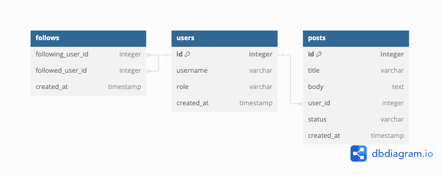

## Stack

- [axum](https://docs.rs/axum/latest/axum/)
  - axum is a web application framework that focuses on ergonomics and modularity.
- [sqlx](https://docs.rs/sqlx/latest/sqlx/)
  - SQLx is an async, pure Rust SQL crate.
- [neon](https://neon.tech/)
  - The fully managed serverless Postgres with a generous free tier.

## [ER diagram](https://dbdiagram.io/home)

